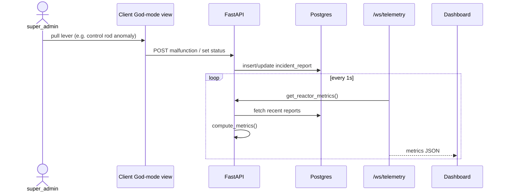
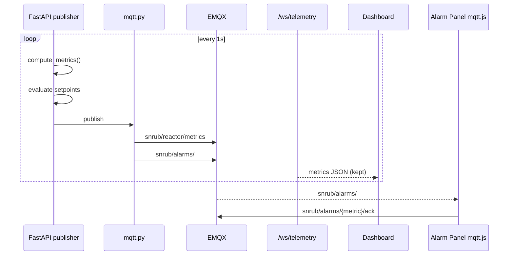
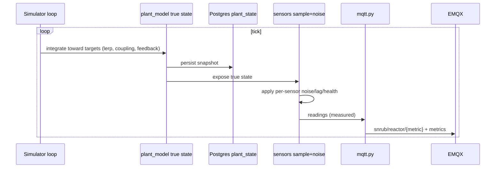
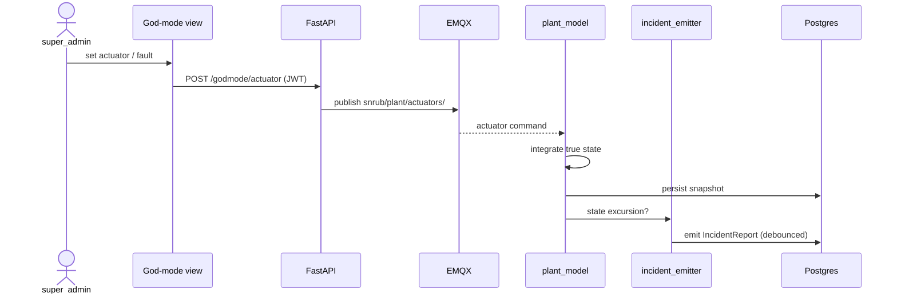
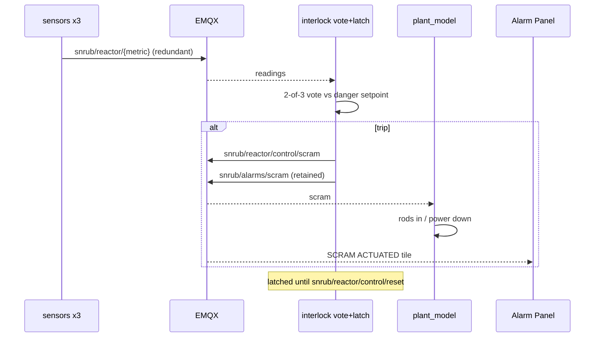
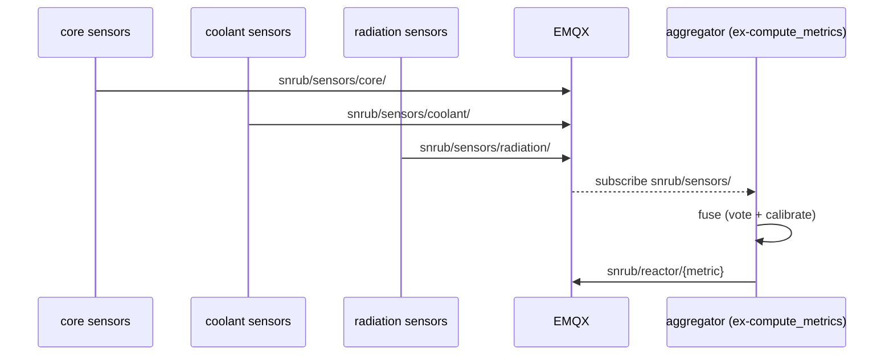

# Roadmap: from incident-derived metrics to a simulated plant

Turns telemetry from a read-only projection of the incident table into a
causal chain: **God mode → actuators → true physical state → sensors →
telemetry → protection**. Each phase is shippable and leaves the app working.

Read `docs/telemetry.md` (metrics, bands, `compute_metrics` algo) and
`docs/mqtt-telemetry.md` (bus rationale, consumers) first — this file
sequences them.

## The invert in one line

Today: `incidents → compute_metrics → metrics`. Metrics are a stateless
recompute of the incident table every tick (`app/services/telemetry.py`).

Target: a persistent **true physical state** driven by actuators (God-mode
levers, faults) and integrated over time; **sensors** sample it (imperfectly);
**telemetry is what the sensors report**, not ground truth; alarms and
interlocks act on telemetry; incidents become *emitted events*, not drivers.

## Layer model (target)

1. **Actuators / causes** — rod position, pump speed, leak rate, steam valve,
   injected xenon. Split into *commands* (normal ops) vs *malfunctions* (the
   God-mode sabotage flavour = existing incident types).
2. **True physical state** — integrated from actuators, coupled, with negative
   feedback (temp↑ → reactivity↓) so it self-stabilises.
3. **Sensors** — sample a subset of (2); per-sensor noise, lag, drift, health.
   `noise()` relocates here from the metric computation.
4. **Telemetry** — published sensor output = the operator view.
5. **Protection / annunciation** — alarm panel + SCRAM interlock act on (4).
6. **Events** — incidents auto-emitted on state excursion; audit trail, not driver.

## Broker choice: EMQX

Chosen over Mosquitto for: MQTT-5, WebSocket listener for `mqtt.js`,
management dashboard (debug the bus visually), and built-in **auth + ACL +
rule engine** so super_admin-only `control/#` and `plant/actuators/#` topics
are broker-enforced. Trade-off: heavier than Mosquitto in the dev stack.
Runs as an added service in `docker-compose.yaml`.

## State persistence note

`CLAUDE.md` / rules: keep the **API stateless, persist state in Postgres**.
The plant model needs tick-to-tick state, so it lives in a dedicated
**simulator loop/process** that persists a `plant_state` snapshot to Postgres
each tick — request handlers stay stateless and read the latest snapshot.

## Topic map (built up across phases)

```
snrub/reactor/metrics                # full blob (compat with current WS payload)
snrub/reactor/{group}/{metric}       # per-metric telemetry (measured)
snrub/alarms/{metric}                # threshold crossings (retained)
snrub/alarms/{metric}/ack            # panel -> bus
snrub/alarms/scram                   # interlock actuation (retained)
snrub/reactor/control/scram          # interlock -> bus
snrub/reactor/control/reset          # manual latch reset
snrub/plant/actuators/#              # God-mode levers / faults (super_admin ACL)
snrub/sensors/{subsystem}/{id}       # raw sensor readings (phase 6)
```

---

## Phase 1 — God mode v0 (no broker)

**Goal.** super_admin-only dashboard view that steers telemetry through the
*existing* incident mechanism. Prove the feel and the UI before any
infrastructure. Levers map onto existing `incident_type_codes`, so
`compute_metrics` already responds.

**Levers → existing codes.**

| Lever | incident_type_code |
|---|---|
| change coolant flow | `coolant_flow_reduction` / `coolant_pump_failure` |
| control rod anomaly | `control_rod_anomaly` |
| primary coolant loss | `primary_coolant_loss` |
| steam system pressure | `steam_pressure_anomaly` |
| xenon buildup | `xenon_poisoning_instability` |

**Services.** No new backend service. Reuse `controllers/incident_report.py`;
add a thin super_admin endpoint in `routes/` for quick malfunction
create/adjust; guard with `verify_super_admin_access`
(`app/security/authorization.py`). New client view in `../snrub.client`.

**Planning prompt.**
> Plan a super_admin-only "God mode" panel that steers reactor telemetry via
> the existing incident pipeline, no broker. In `snrub.api`: add a route +
> controller method to create/adjust "malfunction" incident reports (map the
> five levers to their `incident_type_codes`) and to set incident status
> (drives `STATUS_WEIGHT`); reuse `controllers/incident_report.py` and
> `services/telemetry.py` unchanged; enforce `verify_super_admin_access`. In
> `snrub.client`: add a super_admin-gated dashboard view with a lever per
> malfunction feeding the new endpoint. No new service module. List the exact
> files, request/response schemas (`app/models/`), and integration tests
> (fixtures in `tests/integration/conftest.py`).

**Sequence.**



---

## Phase 2 — EMQX broker + alarm panel (#1)

**Goal.** Stand up the bus and add the first extra consumer. API publishes the
`compute_metrics` dict and evaluates setpoints publisher-side, emitting
`snrub/alarms/#`. Alarm panel is a pure read consumer over `mqtt.js`. Keep
`/ws/telemetry` running.

**Services.** New `app/services/mqtt.py` (publisher wrapper around an MQTT
client). New `app/services/setpoints.py` (or `app/core/`) — extract the bands
from `docs/telemetry.md` prose into one shared config consumed by alarm eval
now and the interlock later (DRY). New alarm evaluation step (in
`controllers/telemetry.py` or a small `services/alarms.py`). EMQX service in
`docker-compose.yaml` (MQTT + WS listener). New alarm-panel view in
`snrub.client`.

**Planning prompt.**
> Add EMQX to `docker-compose.yaml` (MQTT 1883 + WebSocket 8083, dashboard).
> Create `app/services/mqtt.py`: a reusable publisher used by the telemetry
> loop to publish the `compute_metrics` dict to `snrub/reactor/metrics`.
> Create `app/services/setpoints.py` holding per-metric warning/danger bands
> extracted from `docs/telemetry.md`; add a `services/alarms.py` that maps
> current metrics to alarm level and publishes retained `snrub/alarms/{metric}`.
> Keep `/ws/telemetry` unchanged. In `snrub.client`: an Alarm/Annunciator view
> subscribing via `mqtt.js` to `snrub/alarms/#`, publishing
> `snrub/alarms/{metric}/ack`. Cover EMQX auth/ACL basics. List files, the
> setpoint schema, and unit tests for alarm evaluation (isolated, no DB).

**Sequence.**



---

## Phase 3 — True-state / sensor split (the invert)

**Goal.** Introduce persistent physical ground truth and a sensor layer.
`compute_metrics` stops recomputing from `BASE_*` each tick; a simulator loop
integrates true state toward targets (lerp + coupling + negative feedback) and
persists it. Sensors sample true state and apply error — **telemetry becomes
the measured value**. Relocate `noise()` out of metric computation into the
sensor layer.

**Services.** New `app/services/plant_model.py` (true-state integrator; owns
the coupling matrix seeded from `INCIDENT_IMPACT_MAP`). New
`app/services/sensors.py` (sampling + per-sensor noise/lag/health; `noise()`
moves here). New `plant_state` table + migration (Alembic). A dedicated
simulator loop/process (worker) drives ticks and publishes telemetry via
`mqtt.py`. `controllers/telemetry.py` becomes a thin reader of the latest
snapshot. Incidents still feed targets during transition.

**Process architecture (decided).** Run the ticker as a **separate Python
process/container**, not a FastAPI in-process task. Language is Python — it
reuses the domain (coupling matrix, setpoints, models, Alembic), so this is a
new entrypoint (`python -m app.simulator`) on the **same image**, added as a
compose service with `replicas: 1`.

- **Why separate over in-process:** guarantees the loop is a **singleton by
  construction** (two tickers = two integrations racing on the same
  `plant_state` row); keeps tick work off the API event loop (no request-latency
  coupling from per-second DB writes / MQTT publishes); independent lifecycle
  (restart/scale the API without perturbing the sim); honours the "API
  stateless, state in Postgres" rule; and it is already the Phase 6 shape, so no
  later migration.
- **Cost:** one extra compose service (reuses the image) + its own dev reload
  (watchfiles or `docker compose restart simulator`).
- **Commands ride EMQX, not a task queue.** Actuator changes, SCRAM, acks are
  low-volume pub/sub on the bus — the broker is the message layer. **No Celery/
  RQ/Arq/Redis.** Task queues distribute bursty discrete jobs across workers;
  this is one fixed-cadence loop, the opposite shape. A plain
  `while True: … await asyncio.sleep(1)` (monotonic-clock scheduled to avoid
  drift) is sufficient at 1Hz.
- **Advisory-lock caveat:** if you ever fall back to an in-process task, wrap
  the ticker in a **Postgres advisory lock** from day one so a future
  `--workers`/replica bump can't silently spawn a second integrator. Not needed
  for the separate-process design (`replicas: 1` already enforces one).

**Planning prompt.**
> Invert telemetry: create `app/services/plant_model.py` holding a persistent
> physical state integrated per tick (lerp toward targets, coupling seeded from
> `INCIDENT_IMPACT_MAP`, one negative temperature→reactivity feedback term).
> Persist snapshots to a new `plant_state` table (Alembic migration); keep
> request handlers stateless. Create `app/services/sensors.py` that samples
> true state and applies per-sensor noise/lag/health — move `noise()` here out
> of `services/telemetry.py`. Publish sensor output as telemetry
> (`snrub/reactor/{metric}` + `snrub/reactor/metrics`). Add a separate Python
> simulator process (`python -m app.simulator`, same image, compose service,
> `replicas: 1`) that ticks the model — no task queue; commands ride EMQX.
> Incidents still
> contribute to targets for now. List files, the `plant_state` schema, tick
> rate/time-constant knobs, and unit tests for the integrator and sensor error
> models (isolated).

**Sequence.**



---

## Phase 4 — God mode v1 (levers drive actuators)

**Goal.** God-mode levers stop creating incidents and instead set **actuators
and faults** that the plant model integrates. Incidents flip to *emitted
events* on state excursion. super_admin authority enforced by EMQX ACL on
`snrub/plant/actuators/#`. Levers publish through an authenticated API
endpoint (keeps JWT in charge; browser doesn't hold broker creds for control).

**Services.** Extend `plant_model.py` to subscribe to actuator commands and
fold them into targets. New `app/services/incident_emitter.py` (state excursion
→ POST `IncidentReport`, debounced, the #2 auto-reporter). New super_admin
route that validates and republishes lever changes to
`snrub/plant/actuators/#`. Update the client God-mode view to drive actuators
(continuous values + fault toggles) instead of incidents.

**Planning prompt.**
> Promote God mode to drive actuators. Add a super_admin route that accepts
> lever changes (rod position, pump speed, leak rate, steam valve, xenon
> injection) and publishes them to `snrub/plant/actuators/#`; enforce
> `verify_super_admin_access` and an EMQX ACL restricting that topic tree.
> Extend `app/services/plant_model.py` to subscribe and fold actuators/faults
> into its targets (commands vs malfunctions). Create
> `app/services/incident_emitter.py` that watches true state and emits
> debounced `IncidentReport`s on excursion (events, not drivers) — reuse
> `controllers/incident_report.py`. Update the `snrub.client` God-mode view to
> continuous levers + fault toggles. List files, actuator payload schemas,
> ACL config, and integration tests (levers change telemetry; excursions emit
> exactly one incident).

**Sequence.**



---

## Phase 5 — SCRAM interlock with 2-of-3 voting (#7)

**Goal.** First writer / closed loop. A non-UI process watches redundant
sensors, votes 2-of-3 against the danger setpoints, and trips latching SCRAM.
The trip is itself an alarm. The plant model applies the effect (rods in,
power down), metrics fall back through the bands, alarms auto-clear on the
panel — visible confirmation. Latched until manual `control/reset`.

**Services.** New `app/services/interlock.py` (or a standalone process):
subscribes to redundant sensor topics, uses `setpoints.py` (danger band),
holds latch state, publishes `snrub/reactor/control/scram` +
`snrub/alarms/scram`. Extend `plant_model.py` to apply SCRAM to actuators.
Requires phase-3 sensors to support redundancy (≥3 instances per protected
metric). Panel already renders `snrub/alarms/#` — no change.

**Planning prompt.**
> Build a SCRAM interlock as a non-UI subscriber (`app/services/interlock.py`
> or a separate process). Subscribe to redundant sensor readings for
> `core_temperature`, `reactivity`, `coolant_flow_rate`; apply 2-of-3 voting
> against danger setpoints from `services/setpoints.py`. On trip: publish
> latching `snrub/reactor/control/scram` and retained `snrub/alarms/scram`;
> stay latched until `snrub/reactor/control/reset`. Extend
> `app/services/plant_model.py` to apply SCRAM (insert rods, drive power down)
> so telemetry recovers and alarms clear. Ensure phase-3 sensors expose ≥3
> redundant instances per protected metric. List files, latch/reset state
> handling, ACL for `control/#`, and tests: stuck sensor (minority) must not
> block trip; genuine excursion must trip; SCRAM drives recovery.

**Sequence.**



---

## Phase 6 — Sensor network scales out

**Goal.** Generalise the single sensor layer into many independent sensor sim
processes per subsystem, each publishing raw readings. `compute_metrics`'
descendant becomes an **aggregator** that fuses/votes/calibrates raw sensors
into canonical telemetry. Per-sensor fault injection lands here. Optionally
split subsystem publishers into separate containers — the "more plant-like"
step from `docs/mqtt-telemetry.md`.

**Services.** New per-subsystem sensor processes (core, coolant, radiation,
containment) publishing `snrub/sensors/{subsystem}/{id}`. New
`app/services/aggregator.py` (subscribes `snrub/sensors/#`, fuses to
`snrub/reactor/{metric}`) — the evolution of `controllers/telemetry.py` /
`compute_metrics`. Fault-injection hooks (drift, stuck, offset, dropout) per
sensor, drivable from God mode.

**Planning prompt.**
> Scale sensors into independent per-subsystem processes (core, coolant,
> radiation, containment) that read the shared true state and publish
> `snrub/sensors/{subsystem}/{id}` with individual error + health + fault
> injection (drift/stuck/offset/dropout). Create `app/services/aggregator.py`
> that subscribes `snrub/sensors/#` and fuses redundant sensors (voting +
> calibration) into `snrub/reactor/{metric}`, replacing the direct sensor→
> telemetry publish from phase 3. Wire fault injection to God mode. Consider a
> docker-compose profile running sensors as separate containers. List files,
> the sensor/reading schemas, fusion strategy, and tests: fused output rejects
> a single faulted sensor; dropout degrades gracefully.

**Sequence.**



---

## Summary

| Phase | Adds | New services | Risk |
|---|---|---|---|
| 1 | God mode v0 over incidents | none (route only) | low |
| 2 | EMQX + alarm panel | `mqtt.py`, `setpoints.py`, `alarms.py` | low |
| 3 | True-state/sensor split, `noise()` relocation | `plant_model.py`, `sensors.py`, `plant_state` table | high |
| 4 | Levers drive actuators; incidents become events | `incident_emitter.py` | med |
| 5 | SCRAM interlock, 2-of-3 voting | `interlock.py` | med |
| 6 | Sensor network + fusion | sensor processes, `aggregator.py` | med |

Phases 1–2 ship on today's architecture. Phase 3 is the pivot (source-of-truth
moves from the incident table to persistent plant state); everything after
builds on the bus being bidirectional.
